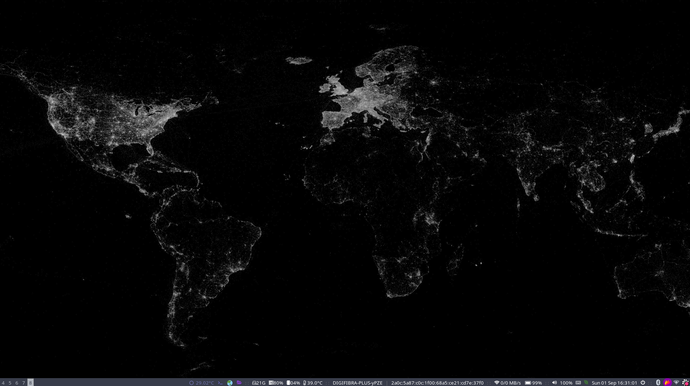

# My Arch Linux dotfiles

This includes configuration files for:

- i3wm
- alacritty
- zsh

## Important notes

I'm using `Hack` font for Alacritty. It's important to have it installed first, so just download it using a [Nerdfont](https://github.com/ryanoasis/nerd-fonts)
